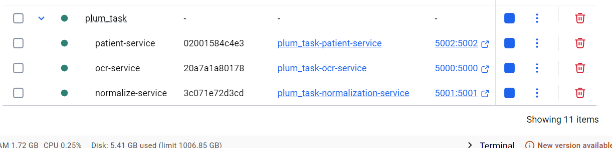
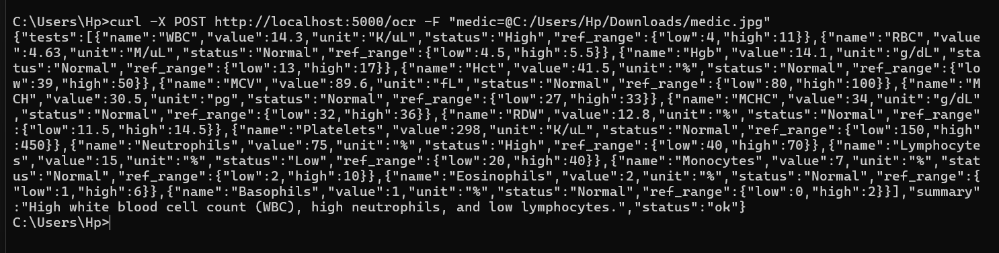
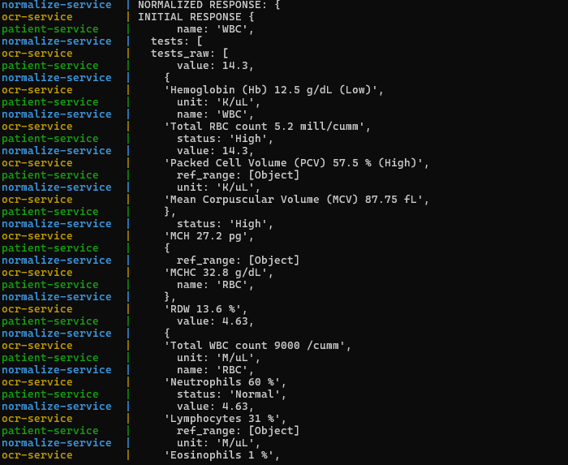
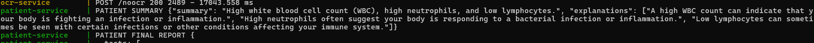
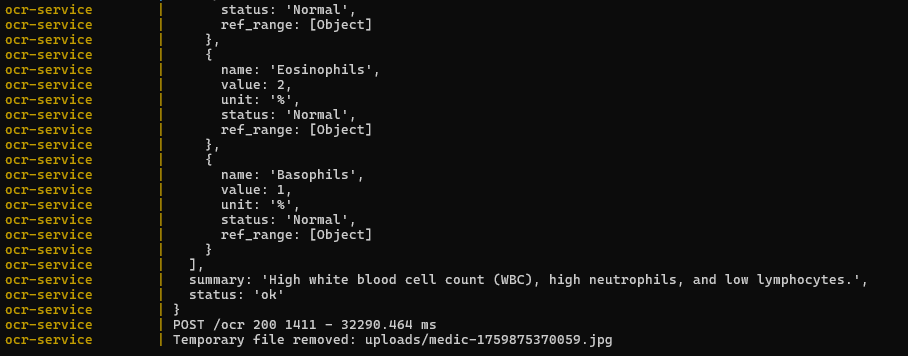

### 🧠 AI-Powered Medical Report Simplifier Backend

Candidate: Fardeen khan

Problem Statement: 7

---

### 🏗 Architecture Overview

This project follows a Microservices Architecture, built using TypeScript, Docker, and Gemini AI API for intelligent summarization and reasoning.

Each service runs in a separate Docker container and communicates through REST APIs, orchestrated using docker-compose.yml.

Services:

1. 🧾 OCR Service

Endpoint: POST /ocr
→ Accepts an image file input and extracts text using Tesseract OCR.

Endpoint: POST /noocr
→ Accepts raw text (when OCR is not needed).

performs medical terminology correction units and names then Outputs test_raw for the Normalization Service.

2. ⚙ Normalization Service

Endpoint: POST /normalize
→ Receives OCR or text input and performs medical terminology correction, format standardization, and unit normalization.

Passes the cleaned data to the Patient Service.

3. 👨‍⚕ Patient Service

Endpoint: POST /patient
→ Receives normalized data, processes it through Gemini AI, and generates:

-A detailed summary and explanation

-Returns the final response as JSON with test and summary.

---

### 🧩 System Flow

1. User calls either /ocr or /noocr.

2. Data flows → Normalization Service → Patient Service.

3. Patient Service produces final AI-generated medical report summary.

---

### 🧰 Technologies & Tools Used

Category	Tools/Frameworks

Language	TypeScript
AI Model	Gemini API
OCR Engine	Tesseract.js
Containerization	Docker, Docker Compose
API Testing	Postman / cURL
Architecture	Microservices
project structure  MCV
Logging	Console + structured logs
Version Control	Git & GitHub

---

### ⚙ Setup Instructions

1️⃣ Clone the Repository

git clone <repo-link>
cd ai-medical-summarizer-backend

2️⃣ Environment Setup

Create a .env file in root for each of the service:

GEMINI_API_KEY=<your-gemini-key>
PORT=5000 (for ocr_service)
prompts=
3️⃣ Run Using Docker Compose

docker-compose up --build

This will automatically spin up:

ocr_service on port 5000

normalization_service on port 5001

patient_service on port 5002

### 4️⃣ Test Using Postman or curl

Example 1 — OCR Flow:

curl -X POST http://localhost:5000/ocr \
  -F "image=@sample_report.png"

Example 2 — Text Input Flow:

curl -X POST http://localhost:5000/noocr \
  -H "Content-Type: application/json" \
  -d '{'texti': 'CBC: Hemglobin 10.2 g/dL (Low)WBC 11200 /uL (Hgh)}'

---

### 🧪 Sample Workflow Screenshot

📸 (Refer to image folder — to be added by user)

---

### 💬 Prompts Used (for Gemini AI)

> The model is prompted with structured data from normalization to generate medical summaries.

### Sample Prompt:
### FOR OCR Service:-
prompt1=You are a professional medical report analyzer. First of all, correct spelling mistakes, errors, and unit errors from the given patient text and structure it clearly. Extract all medical test names, values, units, and statuses. Output ONLY the JSON in this exact format: { \"tests_raw\": [ \"...\", \"...\" ], \"confidence\": 0.80 } Do NOT add extra explanations or any other text. Example: Input text: \"CBC: Hemglobin 10.2 g/dL (Low)WBC 11200 /uL (Hgh), Blood Sugar 120 mg/dL (Normal)\" Output: { \"tests_raw\": [\"Hemoglobin 10.2 g/dL (Low)\", \"WBC 11200 /uL (High)\", \"Blood Sugar 120 mg/dL (Normal)\"], \"confidence\": 0.85 } Patient text:

prompt5=You are a professional medical report analyzer. First of all, correct spelling mistakes, errors, and unit errors from the given patient text and structure it clearly. Extract all medical test names, values, units, and statuses. Output ONLY the JSON in this exact format: { \"tests_raw\": [ \"...\", \"...\" ], \"confidence\": 0.80 } Do NOT add extra explanations or any other text. this is just example when there are only two test present -Example: Input text: \"CBC: Hemglobin 10.2 g/dL (Low)WBC 11200 /uL (Hgh), Blood Sugar 120 mg/dL (Normal)\" Output: { \"tests_raw\": [\"Hemoglobin 10.2 g/dL (Low)\", \"WBC 11200 /uL (High)\", \"Blood Sugar 120 mg/dL (Normal)\"], \"confidence\": 0.85 }.so the output must look like above The text obtained after parsing report image from ocr is ocr text: 

### FOR Normalization service:
prompt2="You are a professional medical data standardization engine.You will receive a JSON input having tests_raw containing a list of strings extracted from a patients medical report.\n\nYour tasks are:\n1. Parse each test string.\n2. Correct any spelling, unit, or format inconsistencies.\n3.Gather name,values,units from the test carefull.\n4. Infer a typical reference range for each test based on standard clinical values (if not provided).\n5. Determine the test status (e.g., \"low\", \"high\", or \"normal\") according to the value and range or stick to label that is given already for each test.\n6. Estimate a confidence score for the normalization step.\n\nReturn ONLY the JSON response in this exact format.\n\n⚠ Note:\nThe following JSON is just an example format shown when the report contains only two tests (Hemoglobin and WBC).\nIn actual use, the output will include multiple tests (e.g., Hemoglobin, WBC, Platelet, RBC, Bilirubin and so on just look into provided test_raw) in the same structured format.\n\n{\n \"tests\": [\n   {\n     \"name\": \"Hemoglobin\",\n     \"value\": 10.2,\n     \"unit\": \"g/dL\",\n     \"status\": \"low\",\n     \"ref_range\": {\"low\": 12.0, \"high\": 15.0}\n   },\n   {\n     \"name\": \"WBC\",\n     \"value\": 11200,\n     \"unit\": \"/uL\",\n     \"status\": \"high\",\n     \"ref_range\": {\"low\": 4000, \"high\": 11000}\n   }\n.... ],\n \"normalization_confidence\": 0.84\n}\n\n.please note that this is just example you need to adhere to format but there might be multiple tests with values you have to include all.\n\n Do not include any additional explanation or text outside the JSON. Info is:"

### FOR Patient service:

prompt3="You are a professional medical report summarizer. You will receive a JSON containing normalized medical tests including names, values, units, statuses, and reference ranges.\n\nYour task is:\n1. Create a clear, patient-friendly summary of the findings.\n2. Provide simple explanations for each abnormal test (low/high/normal), without diagnosing.\n3. If no abnormal tests exist, return {\"status\":\"unprocessed\",\"reason\":\"hallucinated tests not present in input\"}.\n4.please note that below is just example you may get multiple test as well hence you have to add them in summary and explanation accordingly and Output ONLY the JSON in this exact format:\n\n{\n \"summary\": \"Low hemoglobin and high white blood cell count.\",\n \"explanations\": [\n   \"Low hemoglobin may relate to anemia.\",\n   \"High WBC can occur with infections.\"\n ]\n}\nDo not include any extra text or markdown."
prompt4="You are a medical report post-processing engine.\nYou will receive two JSON inputs: 1. A normalized test result JSON from the normalization service. 2. A patient-friendly summary JSON from the patient summary service.\nYour job is to combine both into a single structured JSON response.\nFollow these rules:\n- Preserve all test details from the normalized data (name, value, unit, status, ref_range).\n- Include the summary text exactly as received from the summary service.\n- Add a top-level field \"status\": \"ok\" if both inputs are valid.\n- Return ONLY a valid JSON, nothing else.please note that below is just example you may get multiple test as well you have to group everything in summary\n\nExpected Output (JSON):\n{\n \"tests\": [\n   {\"name\":\"Hemoglobin\",\"value\":10.2,\"unit\":\"g/dL\",\"status\":\"low\",\"ref_range\":{\"low\":12.0,\"high\":15.0}},\n   {\"name\":\"WBC\",\"value\":11200,\"unit\":\"/uL\",\"status\":\"high\",\"ref_range\":{\"low\":4000,\"high\":11000}}\n ],\n \"summary\": \"Low hemoglobin and high white blood cell count.\",\n \"status\": \"ok\"\n}\nDo not include any extra text or markdown."

note:Add in the same way in each enviroment

---

### 🧠 Architecture and Data Handling Choices

Microservices separation ensures modularity and scalability.

Stateless communication between services (JSON REST calls).

Gemini AI adds medical intelligence and context understanding.

Normalization layer acts as a pre-processor for data consistency.

Docker simplifies environment replication and portability.

---

### 🧩 Sample Response
for post /noocr
{"tests":[{"name":"WBC","value":14.3,"unit":"K/uL","status":"High","ref_range":{"low":4,"high":11}},{"name":"RBC","value":4.63,"unit":"M/uL","status":"Normal","ref_range":{"low":4.5,"high":5.5}},{"name":"Hgb","value":14.1,"unit":"g/dL","status":"Normal","ref_range":{"low":13,"high":17}},{"name":"Hct","value":41.5,"unit":"%","status":"Normal","ref_range":{"low":39,"high":50}},{"name":"MCV","value":89.6,"unit":"fL","status":"Normal","ref_range":{"low":80,"high":100}},{"name":"MCH","value":30.5,"unit":"pg","status":"Normal","ref_range":{"low":27,"high":33}},{"name":"MCHC","value":34,"unit":"g/dL","status":"Normal","ref_range":{"low":32,"high":36}},{"name":"RDW","value":12.8,"unit":"%","status":"Normal","ref_range":{"low":11.5,"high":14.5}},{"name":"Platelets","value":298,"unit":"K/uL","status":"Normal","ref_range":{"low":150,"high":450}},{"name":"Neutrophils","value":75,"unit":"%","status":"High","ref_range":{"low":40,"high":70}},{"name":"Lymphocytes","value":15,"unit":"%","status":"Low","ref_range":{"low":20,"high":40}},{"name":"Monocytes","value":7,"unit":"%","status":"Normal","ref_range":{"low":2,"high":10}},{"name":"Eosinophils","value":2,"unit":"%","status":"Normal","ref_range":{"low":1,"high":6}},{"name":"Basophils","value":1,"unit":"%","status":"Normal","ref_range":{"low":0,"high":2}}],"summary":"High white blood cell count (WBC), high neutrophils, and low lymphocytes.","status":"ok"}

---

### 🪲 Known Issues

-OCR accuracy may vary with image quality.

-Medical range inference is generalized (not patient-specific).

-Gemini AI API response latency under heavy load may be poor sometimes.Value mismatch, hallucinations are common problems.

-Multi-language reports not yet supported.

---

### 🚀 Future Improvements

-Integrate cloud deployment (e.g., GCP / AWS Lambda).

-Add authentication & logging middleware.

-Introduce caching for repeated test formats.

-A separate service for incorrect,hallucination etc issues handling 

-Support multilingual medical text.

---

### 📂 Repository Structure

root/
├── ocr_service/
│   ├── folders...
│   ├── Dockerfile
│   └── package.json
|   └── index.ts
     
├── normalization_service/
│   ├── folders...
│   ├── Dockerfile
│   └── package.json
|   └── index.ts
├── patient_service/
│   ├── folders...
│   ├── Dockerfile
│   └── package.json
|   └── index.ts
├── docker-compose.yml
└── README.md
└── images

